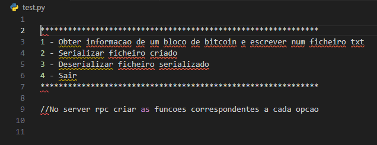
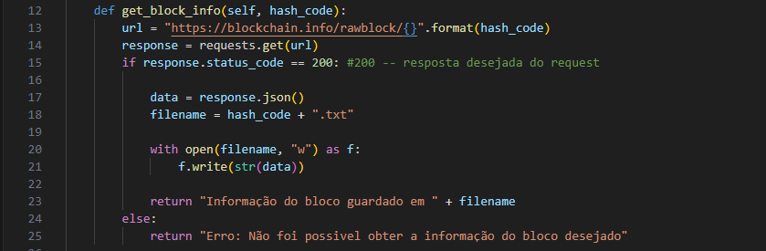
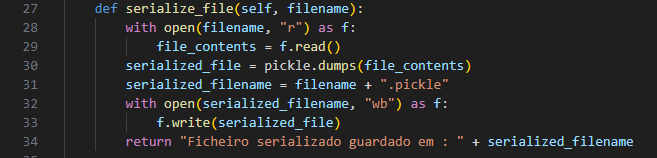

# Luis Barros, 1700331, Engenharia Informática

# 1. Descrição do Trabalho

Neste relatório irá ser demonstrado todo o processo de criação de um cliente e server RPC,
cujo objetivo é de serializar e desserilizar informação relativa a um bloco de Bitcoin. De
modo a fazer a serialização e desserialização da informação é necessário fazer o ‘request’
da mesma e escrever num ficheiro, para que seja possível fazer a serialização e
desserialização do mesmo. Para a realização deste projeto foi usado um API da
blockchain.com para obter a informação de um bloco de Bitcoin possibilitando assim obter
informação bruta relativa a um bloco de Bitcoin usando um GET request , desde que seja
fornecido o hash code do bloco pretendido. Na figura a baixo é demonstrada a arquitetura
usada para o desenvolvimento deste trabalho 
  
  
  # 2. Implementação do Trabalho

  Inicialmente foi feito um teste com um simples ficheiro em python para recolher informação
de um bloco de bitcoin quando feito o input do código hash.Código esse mostrado na figura 
seguinte :   
     
  Na linha 1 é feita a importação da biblioteca requests falada anteriormente, na linha 3 defini
o endpoint URL para a API, na linha 7 é feito o request e guarda a resposta, na linha 10
acontece que se o estado da resposta não for a desejada levanta uma exceção, na linha 12
é criado um ficheiro com o nome “código hash” em formato txt. Na linhas 13 abre esse
mesmo ficheiro em modo write(escrita) e na linha 15 escreve a resposta guardada na linha
7 no ficheiro retornando depois na linha 17 que o ficheiro foi guardado.
Após este código funcionar foi apenas necessário implementar o mesmo em um servidor
RPC, tal como a serialização e desserialização do ficheiro gerado.
De seguida criei um ficheiro com a ideia da interface mostrada ao cliente podendo o mesmo
escolher se desejaria obter informação de um bloco de Bitcoin, serializar o ficheiro com a
informação ou desserializar o ficheiro.
Ficheiro esse mostrado de seguida : 
                 
  De seguida foi necessária a implementação no servidor RPC com as funções correspondentes a cada opção possível para o cliente : 
  Esta função é basicamente o mesmo do que aquilo mostrado no ficheiro.
      
    Uma breve explicação do que o código faz é o seguinte : Na linha 13 é definido o URL do API da blockchain onde vai buscar a informação do bloco, na linha 14 faz um request GET ao API da blockchain, na linha 15 confirma se o estado da resposta é de 200, o que significa que o request foi bem sucedido. Na linha 17 analisa a informação JSON e coloca-a num dicionário Python, na linha 18 cria um ficheiro txt em que o nome é o código hash. Na linha 20 abre esse mesmo ficheiro em modo escrita e na linha 21 escreve os dados brutos do bloco no ficheiro. Se o estado da resposta é o desejado retorna ao cliente que a informação do bloco foi guardada no ficheiro, caso contrário retorna uma mensagem de erro. 

De modo a que o utilizador apenas necessite de saber o código hash do bloco para funcionar sempre com o mesmo input e não necessitar de ir à procura dos nomes dos ficheiros que deseja serializar ou desserializar tornei esse o único input para todas as opções , ou seja, o input para obter informação do bloco, serializar o ficheiro e desserializar o ficheiro é o código hash do bloco pretendido. Isto possibilita também que o cliente trabalhe com mais do que um ficheiro e mais do que um bloco e a sua informação. 
  De seguida demonstro a função de serialização: 
  
    Este método de serialização foi usado nas aulas, de qualquer das maneiras, irei explicar o funcionamento do mesmo. 
  Na linha 28 abre o ficheiro em modo leitura, na linha 29 lê o conteúdo desse mesmo ficheiro. Depois na linha 30 usando a livraria do pickle é serializado o conteúdo do ficheiro, na linha 32  é serializado o próprio ficheiro anexando “.pickle” ao ficheiro original, na linha 32 abre o ficheiro serializado em modo escrita binária, na linha 33 escreve o conteúdo serializado no ficheiro também serializado, na linha 34 retorna que o ficheiro serializado foi guardado juntamente com o nome do ficheiro. 

