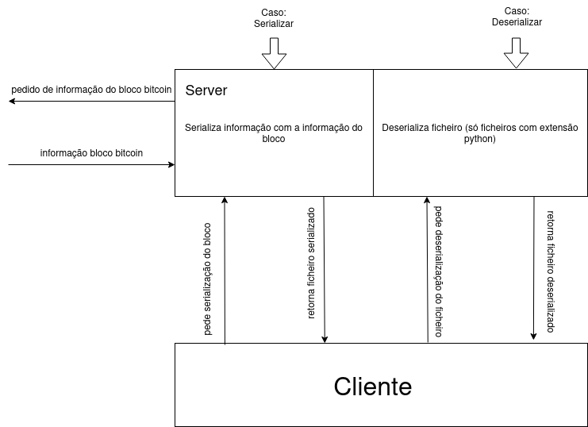
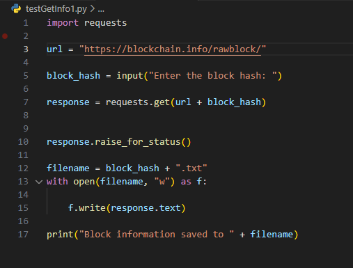

# Luis Barros, 1700331, Engenharia Informática

# 1. Descrição do Trabalho

Neste relatório irá ser demonstrado todo o processo de criação de um cliente e server RPC,
cujo objetivo é de serializar e desserilizar informação relativa a um bloco de Bitcoin. De
modo a fazer a serialização e desserialização da informação é necessário fazer o ‘request’
da mesma e escrever num ficheiro, para que seja possível fazer a serialização e
desserialização do mesmo. Para a realização deste projeto foi usado um API da
blockchain.com para obter a informação de um bloco de Bitcoin possibilitando assim obter
informação bruta relativa a um bloco de Bitcoin usando um GET request , desde que seja
fornecido o hash code do bloco pretendido. Na figura a baixo é demonstrada a arquitetura
usada para o desenvolvimento deste trabalho 
  
  
  # 2. Implementação do Trabalho

  Inicialmente foi feito um teste com um simples ficheiro em python para recolher informação
de um bloco de bitcoin quando feito o input do código hash.Código esse mostrado na figura 
seguinte :  
  
Na linha 1 é feita a importação da biblioteca requests falada anteriormente, na linha 3 defini
o endpoint URL para a API, na linha 7 é feito o request e guarda a resposta, na linha 10
acontece que se o estado da resposta não for a desejada levanta uma exceção, na linha 12
é criado um ficheiro com o nome “código hash” em formato txt. Na linhas 13 abre esse
mesmo ficheiro em modo write(escrita) e na linha 15 escreve a resposta guardada na linha
7 no ficheiro retornando depois na linha 17 que o ficheiro foi guardado.
Após este código funcionar foi apenas necessário implementar o mesmo em um servidor
RPC, tal como a serialização e desserialização do ficheiro gerado.
De seguida criei um ficheiro com a ideia da interface mostrada ao cliente podendo o mesmo
escolher se desejaria obter informação de um bloco de Bitcoin, serializar o ficheiro com a
informação ou desserializar o ficheiro.
Ficheiro esse mostrado de seguida :

